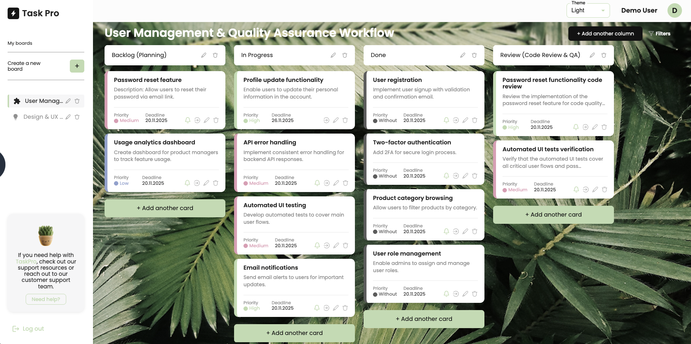
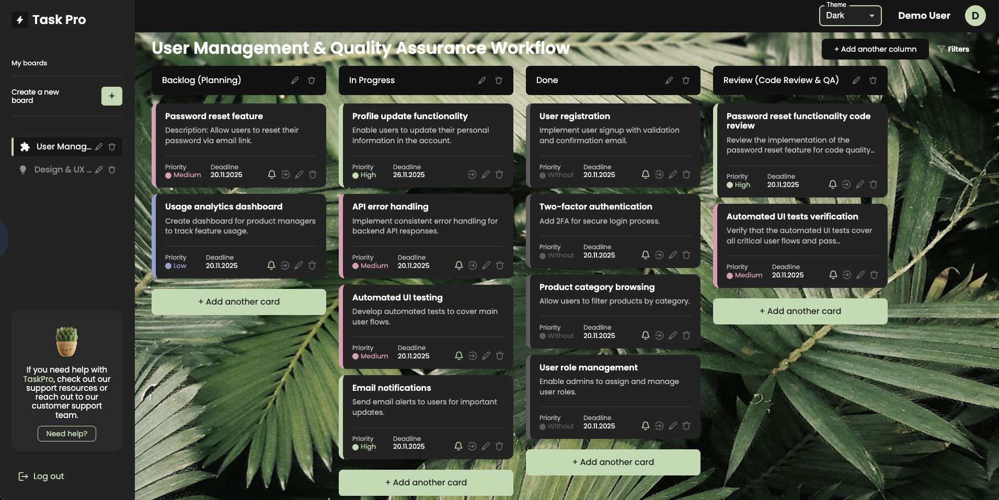

<p align="center">
  
  
</p>

# TaskPro Frontend

TaskPro is a Kanban‑style productivity application for organizing projects into Boards, Columns and Cards with status, priority labels, deadlines and theming. It demonstrates modern React architecture, token‑based authentication, theming, modular styling and API integration. Use this repository as a portfolio example: it shows structured state management, component design, API abstraction, UX modals, and accessibility touches.

## Demo Flow (User Journey)

1. Landing (WelcomePage) offers Registration or Login.
2. After authentication, user sees Sidebar with Boards list; if none exist, a contextual prompt invites board creation.
3. Creating a Board opens modal (BoardModal) to define name & background.
4. Inside a Board (BoardDetail) user adds Columns and Cards, assigns priority (Low/Medium/High/Without), date, description.
5. Tasks can be filtered by priority via in‑board filters.
6. Theme selector (Light / Dark / Violet) adjusts palette and component styling.
7. Profile modal (UserInfo) allows updating avatar, name, password.
8. Help modal (HelpModal) submits support message to backend.
9. Logout clears token and redirects.

## Core Features

- Boards / Columns / Cards CRUD
- Priority & deadline assignment (see label definitions in [src/components/AddCardModal.jsx](src/components/AddCardModal.jsx))
- Dynamic task filtering (BoardDetail local filter logic)
- Theming (styled-components theme propagation + conditional CSS Modules)
- Auth (JWT localStorage + axios interceptors)
- Profile management (avatar upload & optional password change)
- Support request modal (client-side validation: min message length)
- Responsive layout (mobile‑first CSS modules)
- Graceful token expiration handling (401 interceptor resets session)
- Accessible interactive elements (keyboard handlers on “create a board” trigger)

## Technology Stack

- React (Create React App bootstrap)
- Redux (auth / boards / columns / cards slices and selectors)
- react-router-dom (routing)
- styled-components (theming + scoped styles)
- CSS Modules (component‑specific styles, e.g. [src/components/Sidebar.module.css](src/components/Sidebar.module.css))
- Material UI (select inputs, date pickers, some icons)
- Day.js (date handling in card creation)
- Axios (custom instance with interceptors: [src/services/axios.js](src/services/axios.js))
- Modern Normalize (consistent base: [src/index.css](src/index.css))

## Project Structure (High-Level)

- Pages: [src/pages/WelcomePage/WelcomePage.jsx](src/pages/WelcomePage/WelcomePage.jsx), [src/pages/HomePage/HomePage.jsx](src/pages/HomePage/HomePage.jsx), screens & placeholders (NotFound / ScreensPage).
- Core UI Components: Sidebar, BoardDetail, BoardModal, AddCardModal, HelpModal, UserInfo.
- API Layer: Endpoint constants in [src/api/endpoint.js](src/api/endpoint.js); single axios instance in [src/services/axios.js](src/services/axios.js).
- State: Redux slices (auth, boards, columns, cards) with selectors (e.g. selectSelectedBoard).
- Assets: Icons & images in /src/assets.

## API Endpoints (Frontend Constants)

Defined in [src/api/endpoint.js](src/api/endpoint.js). Examples:

- Auth: auth/register, auth/login, auth/logout
- Users: users/current, users/current/theme
- Boards: api/boards, api/boards/:boardId
- Columns: api/columns, api/columns/:columnId
- Cards: api/cards, api/cards/:cardId, api/cards/:cardId/status
- Support Email: email/support
- Help (modal): /api/help (POST in [src/components/HelpModal.jsx](src/components/HelpModal.jsx))

Authentication: Bearer token automatically injected (axios request interceptor). 401 triggers token removal + redirect (see [src/services/axios.js](src/services/axios.js)).

## Theming

Conditional styling based on theme value (“light”, “dark”, “violet”). Example: MUI Select custom sx logic in HomePage (see theme‑based border & icon colors in [src/pages/HomePage/HomePage.jsx](src/pages/HomePage/HomePage.jsx)). Scrollbar color overrides for violet theme in [src/components/Sidebar.module.css](src/components/Sidebar.module.css).

## State & Data Flow

1. Login dispatches auth slice; token stored in localStorage.
2. Initial load fetches current user (theme, profile).
3. Selecting a board triggers fetch of columns & cards.
4. BoardDetail maintains local UI state for filtering (selectedFilters), ordering (tasksOrder), active drag item (activeId placeholder for potential DnD extension).
5. User actions (create column/card) optimistically update Redux then reconcile server response.

## UX & Validation Highlights

- Minimum message length enforcement in HelpModal (≥10 chars).
- Disabled email field if user already has email.
- Date input with Material UI DatePicker (AdapterDayjs).
- Visual emphasis prompts (underline & keyboard activation) for “create a board” when empty state.

## Security Considerations

- Token confined to localStorage (simple approach; could be migrated to httpOnly cookies for improved security).
- Interceptor purges token on unauthorized.
- Conditional disabling of profile fields reduces accidental mutation.
- Future improvements: centralized error boundary, rate limiting for help endpoint, CSRF protection if cookie‑based auth adopted.

## Accessibility

- Keyboard events on actionable spans (Enter/Space).
- Focus management in modals (first input autoFocus).
- Color contrasts considered for dark/violet themes (textColor utilities inside BoardDetail).

## Setup

```bash
git clone <your-fork-or-origin-url>
cd taskpro-frontend
npm install
npm start
```

Development server: http://localhost:3000

## Environment Variables (Recommended)

Create `.env`:

```
REACT_APP_API_BASE=https://taskpro-backend-65h4.onrender.com
```

Then update baseURL usage in [src/services/axios.js](src/services/axios.js) to:

```js
const instance = axios.create({ baseURL: process.env.REACT_APP_API_BASE });
```

## Build

```bash
npm run build
```

Generates production bundle in /build.

## Testing (Next Step Suggestion)

Currently minimal tests. Suggested additions:

- Unit tests for filtering logic in BoardDetail.
- Integration tests for auth flow.
- Component tests for modals (open/close & validation).

## Future Enhancements

- Drag & drop (dnd-kit or react-beautiful-dnd) integrated with tasksOrder.
- TypeScript migration for stronger typing.
- Toast notifications for success/error (replacing alert in HelpModal).
- Offline caching (service worker) & PWA adjustments.
- Centralized error handling & retry strategies.
- Role-based permissions (multi-user boards).
- Analytics events (board creation, task completion).

## Why This Project Is Portfolio-Relevant

- Showcases end‑to‑end flow (auth → data → UI → interaction).
- Demonstrates component composition + clear separation (API layer vs UI).
- Implements theming & conditional styling patterns.
- Uses modern React practices (hooks, modular state).
- Provides real-world features (support messaging, profile management).

## License

Proprietary / Personal Portfolio Example (adjust as needed). Remove any remaining Create React App boilerplate references if not required.
